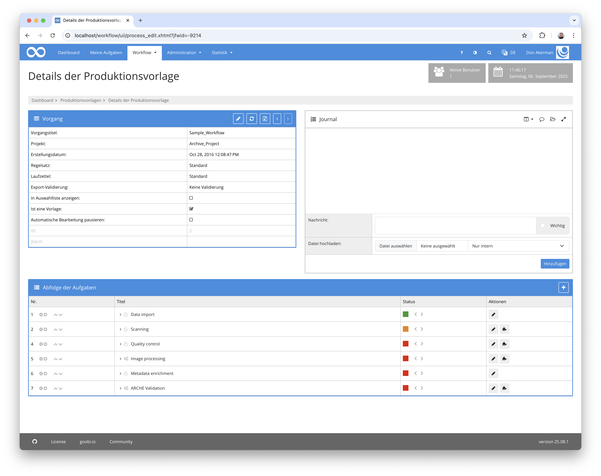
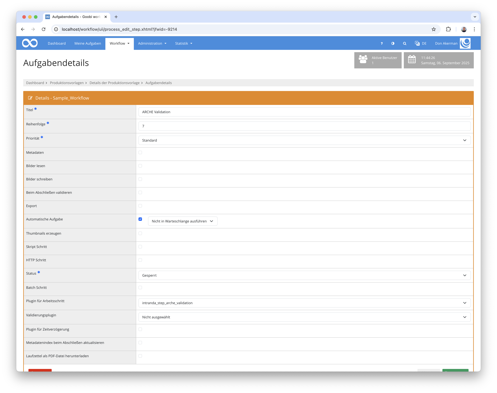

## Einführung
Diese Dokumentation erläutert das Plugin für die Validierung von Metadaten und Eigenschaften.

## Installation
Um das Plugin nutzen zu können, müssen folgende Dateien installiert werden:

```bash
/opt/digiverso/goobi/plugins/step/plugin-step-arche-validation-base.jar
/opt/digiverso/goobi/config/plugin_intranda_step_arche_validation.jar
```

Außerdem muss das Plugin `intranda_step_file_validation` installiert und konfiguriert sein.

Nach der Installation des Plugins kann dieses innerhalb des Workflows für die jeweiligen Arbeitsschritte ausgewählt und somit automatisch ausgeführt werden. Ein Workflow könnte dabei beispielhaft wie folgt aussehen:



Für die Verwendung des Plugins muss dieses in einem Arbeitsschritt ausgewählt sein:




## Überblick und Funktionsweise

Das Plugin ist in der Lage, das Vorgandensein von definierten Eigenschaften für das Projekt und den Vorgang zu prüfen. Außerdem können Pflichtmetadaten geprüft werden.
Zusätzlich werden alle Dateien im `master`-, `media`- und `alto`-Ordner validiert.


## Konfiguration
Die Konfiguration des Plugins erfolgt in der Datei `plugin_intranda_step_arche_validation.xml` wie hier aufgezeigt:

{{CONFIG_CONTENT}}

{{CONFIG_DESCRIPTION_PROJECT_STEP}}

Parameter                   | Erläuterung
----------------------------|------------------------------------
`requiredProjectProperties` | Enthält eine Liste von Eigenschaften, die im Projekt vorhanden sein müssen
`requiredProcessProperties` | Enthält eine Liste von Eigenschaften, die im Vorgang enthalten sein müssen
`requiredMetadata`          | Enthält eine Liste von Metadaten, die existieren müssen

Die weitere Konfiguration für die Validierung der Dateien findet im Plugin `intranda_step_file_validation` statt.
