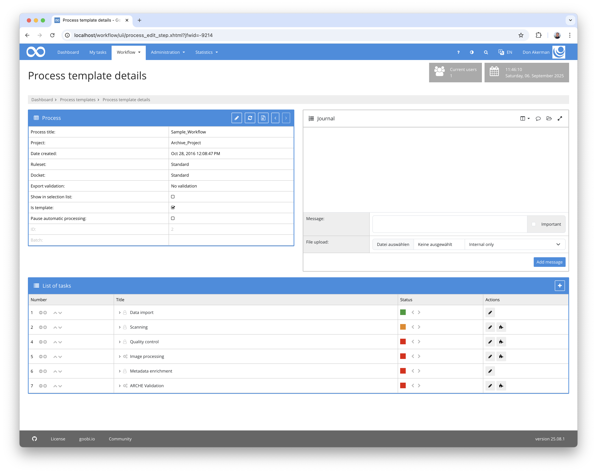
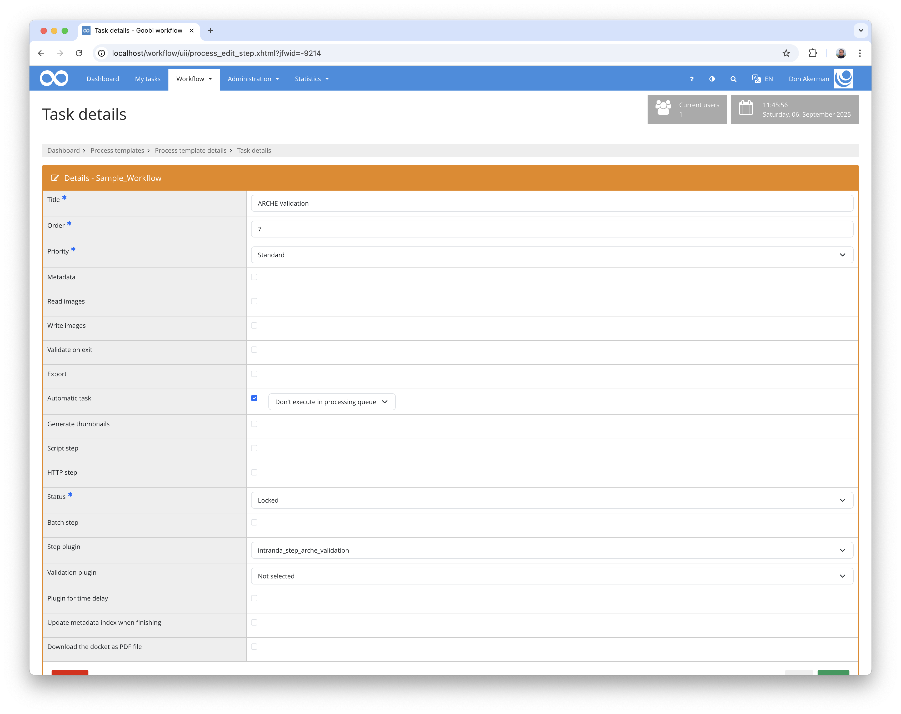

## Introduction
This documentation explains the plugin for validating metadata and properties.

## Installation
To use the plugin, the following files must be installed:

```bash
/opt/digiverso/goobi/plugins/step/plugin-step-arche-validation-base.jar
/opt/digiverso/goobi/config/plugin_intranda_step_arche_validation.jar
```

In addition, the `intranda_step_file_validation` plugin must be installed and configured.

Once the plugin has been installed, it can be selected within the workflow for the respective work steps and thus executed automatically. An example workflow could look like this:



Für die Verwendung des Plugins muss dieses in einem Arbeitsschritt ausgewählt sein:




## Overview and functionality

The plugin is able to check the existence of defined properties for the project and the process. Mandatory metadata can also be checked.
In addition, all files in the `master`, `media` and `alto` folders are validated.

## Configuration
The plugin is configured in the file `plugin_intranda_step_arche_validation.xml` as shown here:

{{CONFIG_CONTENT}}

{{CONFIG_DESCRIPTION_PROJECT_STEP}}

Parameter                   | Explanation
----------------------------|------------------------------------
`requiredProjectProperties` | Contains a list of properties that must be present in the project.
`requiredProcessProperties` | Contains a list of properties that must be included in the operation.
`requiredMetadata`          | Contains a list of metadata that must exist

Further configuration for file validation takes place in the plugin `intranda_step_file_validation`.
